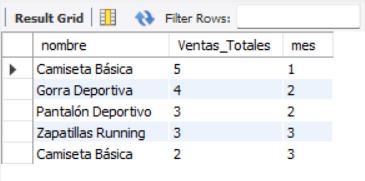

### PUNTO 1


Las violaciones posibles a la integridad referencial ocurririan debido a la relacion entre la PRIMARY KEY de Estudiantes y la FOREIGN KEY de Matriculas llamada id_estudiantes. Si se elimina un estudiante, se producira una violacion a la integridad referencial si no se maneja adecuadamente con restricciones.


Las restricciones que utilizaria serian:

```SQL
ON DELETE RESTRICT;
# Lanza un error si se desea eliminar un estudiante que esta inscripto en un curso
``` 


```SQL
ON DELETE CASCADE; 
# No permite eliminar un estudiante que se encuentra inscripto a un curso
```

```SQL
ON DELETE SET NULL;
# Se podria utilizar esta restriccion, pero si el interes principal de ver la tabla es saber que estudiante 
# tomo que curso entonces terminaria impidiendo ese fin. Por otro lado, tambien podria interesarte 
# saber datos generales acerca de la matriculacion, como la edad promedio de los estudiantes, por lo que esta 
# opcion no se descarta y hasta podria ser la mas util para analizar informacion pasada.
```


### PUNTO 2


```SQL
CREATE TABLE Estudiantes (
        id_estudiante INT PRIMARY KEY,
        nombre VARCHAR(100),
        apellido VARCHAR(100),
        fecha_nacimiento DATE
);


CREATE TABLE Matriculas(
        id_matricula INT PRIMARY KEY,
        id_estudiante INT,
        id_curso INT,
        fecha_matricula DATE
        FOREIGN KEY (id_estudiante) REFERENCES Estudiantes(id_estudiante) ON DELETE RESTRICT
);

INSERT INTO Estudiantes(1, 'Juan', 'Perez', '2002-12-12')


INSERT INTO Matriculas(2, 1, 10, '2025-04-05')


DELETE FROM Estudiantes WHERE id_estudiante = 1;
```


### PUNTO 3


No podemos hacer dos transacciones al mismo tiempo, pero `READ COMMITED` deberia hacer que solo se aplique una de las transacciones, mientras que la otra se perderia. Mientras que en `SERIALIZABLE` no se pisan entre ambos, una espera a que la otra haga commit para ejecutarse o se lanza un error.


### PUNTO 4


Al utilizar: 

```SQL
CREATE INDEX idx_categoria ON productos(categoria);


EXPLAIN SELECT nombre, categoria FROM productos WHERE categoria = 'Hogar'
```


En lugar de solo el select, es mucho mas eficiente, ya que en lugar de analizar mas de 90mil filas, solo lee 23mil


### PUNTO 5

```SQL
EXPLAIN SELECT nombre, categoria, marca FROM productos WHERE nombre = 'Mission Lite';
```

Cree esta consulta que filtra por 3 campos, utilizando indices de cada uno, obtengo que el mas rapido es claramente nombre, ya que solo busca en 20 registros para el caso de "Mission lite"


### PUNTO 6


Creamos tablas en SQL para poder demostrar el ejercicio:
```SQL
CREATE TABLE productos (
    id_producto INT PRIMARY KEY AUTO_INCREMENT,
    nombre VARCHAR(100) NOT NULL,
    precio DECIMAL(10,2) NOT NULL,
    stock INT DEFAULT 0
);

-- Tabla de ventas
CREATE TABLE ventas (
    id_venta INT PRIMARY KEY AUTO_INCREMENT,
    id_producto INT NOT NULL,
    cantidad INT NOT NULL,
    total DECIMAL(10,2) NOT NULL,
    fecha DATE NOT NULL,
    mes INT GENERATED ALWAYS AS (MONTH(fecha)) STORED,
    FOREIGN KEY (id_producto) REFERENCES productos(id_producto)
);
```

A continuacion creamos la vista con un query que nos permita ver los 5 productos mas vendidos agrupados por mes (del 1 al 12, 1 siendo Enero y 12 siendo Diciembre):

```SQL
CREATE VIEW `5_productosMasVendidos` AS
SELECT nombre, SUM(cantidad) as Ventas_Totales, mes 
FROM productos 
INNER JOIN ventas ON productos.id_producto = ventas.id_producto
GROUP BY nombre, mes
ORDER BY Ventas_Totales DESC
LIMIT 5; 
```
Podemos llamar esta vista cuando queramos usando el siguiente codigo SQL:
```SQL
SELECT * FROM `5_productosmasvendidos`;
```
Resultado:




### PUNTO 7


-- Agregar codigo


Al crear un usuario analista con unicamente los permisos de conexion a la base de datos y querer hacer una consulta SELECT, este es el error que se presenta: Error Code: 1142. SELECT command denied to user 'analista'@'localhost' for table 'productos'


### PUNTO 8

```SQL
CREATE TABLE Auditoria_usuarios (
    id INT AUTO_INCREMENT PRIMARY KEY,
    id_usuario INT,
    accion VARCHAR(10),
    datos_viejos JSON,
    datos_nuevos JSON,
    fecha TIMESTAMP DEFAULT CURRENT_TIMESTAMP
);


DELIMITER $$


CREATE TRIGGER t_auditoria_insert_usuarios
AFTER INSERT ON usuarios
FOR EACH ROW
BEGIN
    INSERT INTO Auditoria_usuarios (id_usuario, accion, datos_viejos, datos_nuevos, fecha)
    VALUES (NEW.id_usuario, 'INSERT', NULL, JSON_OBJECT('id_usuario', NEW.id_usuario, 'nombre', NEW.nombre), CURRENT_TIMESTAMP);
END$$


DELIMITER ;


DELIMITER $$


CREATE TRIGGER t_auditoria_update_usuarios
AFTER UPDATE ON usuarios
FOR EACH ROW
BEGIN
    INSERT INTO Auditoria_usuarios (id_usuario, accion, datos_viejos, datos_nuevos, fecha)
    VALUES (NEW.id_usuario, 'UPDATE', JSON_OBJECT('id_usuario', OLD.id_usuario, 'nombre', OLD.nombre), JSON_OBJECT('id_usuario', NEW.id_usuario, 'nombre', NEW.nombre), CURRENT_TIMESTAMP);
END$$


DELIMITER ;


DELIMITER $$


CREATE TRIGGER t_auditoria_delete_usuarios
AFTER DELETE ON usuarios
FOR EACH ROW
BEGIN
    INSERT INTO Auditoria_usuarios (id_usuario, accion, datos_viejos, datos_nuevos, fecha)
    VALUES (OLD.id_usuario, 'DELETE', JSON_OBJECT('id_usuario', OLD.id_usuario, 'nombre', OLD.nombre), NULL, CURRENT_TIMESTAMP);
END$$


DELIMITER ;


SELECT * FROM Auditoria_usuarios;
```


### PUNTO 9
Creamos el backup con el siguiente comando y tenemos que poner la constrasenia del usuario que decidimos usar, en este caso `root`:

<image src="img/ss_crear_backup.png">

Podemos ver el archivo que se crea a partir de este comando haciendo click en el siguiente link: [backup_basededatospiola.sql](backup_basededatospiola.sql)

A continuacion borramos la base de datos que fue guardada, creamos una nueva donde vamos a volver a subir los datos que guardamos en el backup y ejecutamos el siguiente comando para volver a descargarla y ver si funciona:
```SQL
DROP DATABASE basededatospiola;
CREATE DATABASE basededatospiolaBackupeada;
```
<image src="img/ss_descargar_backup.png">

A continacion podemos ver que si funciono ya que las tablas y la base de datos se encuentran en el server de sql:

<image src="img/ss_comprobar_exito.png">
