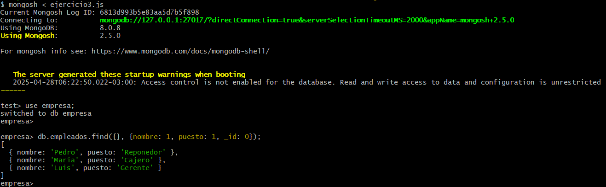

# PRACTICO 2

### Ejercicio 1
Consigna:
    *1 - Crea una base de datos llamada empresa.
    2 - Agrega una colección empleados con 3 documentos que incluyan nombre, edad y puesto.
    3 - Actualiza la edad de uno de los empleados.
    4 - Elimina al empleado que tenga el puesto de "pasante".*

##### A continuacion adjuntamos una captura con los comandos ejecutados en la terminal:

    

### Ejercicio 2
Consigna:
*Consulta todos los empleados cuya edad esté entre 25 y 40 años. Usa operadores relacionales y lógicos.*

##### A continuacion adjuntamos una captura con los comandos ejecutados en la terminal:

    

### Ejercicio 3
Consigna:
*Recupera los nombres y puestos de todos los empleados, sin mostrar el `_id.`*

##### A continuacion adjuntamos una captura con los comandos ejecutados en la terminal:

    

### Ejercicio 4
Consigna:
*Agrega un campo direccion que incluya `calle`, `ciudad` y `codigo_postal`.*

##### A continuacion adjuntamos una captura con los comandos ejecutados en la terminal:

    

### Ejercicio 5
Consigna:
*Dada una colección `ventas` con campos `producto`, `cantidad` y `precio_unitario`, calcula el total de ventas por producto usando `$group` y `$sum`.*

##### A continuacion adjuntamos una captura con los comandos ejecutados en la terminal:

    

### Ejercicio 6
Consigna:
*Crea un índice compuesto sobre los campos `apellido` y `nombre` en una colección de `clientes`*

##### A continuacion adjuntamos una captura con los comandos ejecutados en la terminal:

    

### Ejercicio 7
Consigna:
*Crea una colección `cursos` y una colección `alumnos`. Luego inserta documentos donde los alumnos tengan una lista de  `id_curso` referenciando a los cursos.*

Primero vamos a crear la coleccion cursos para poder extraer el id de cada documento

##### Captura con el primer paso:

    

Despues de eso ya podemos crear la coleccion alumnos con cada documento teniendo un campo `curso` que haga referencia al id del curso.

##### Captura con el segundo y ultimo paso:

    

### Ejercicio 8
Consigna:
*Realiza una agregación donde se combinen los datos de alumnos y cursos usando `$lookup`.*

##### A continuacion adjuntamos una captura con los comandos ejecutados en la terminal:

    

### Ejercicio 9
Consigna:
*Describe con tus palabras las ventajas de usar un Replica Set y qué beneficios aporta el sharding en una base de datos de alto volumen.*

### Ejercicio 10
Consigna:
*Muestra los pasos para crear un usuario con permisos de lectura y escritura, y los comandos necesarios para hacer backup y restauración de una base de datos.*
